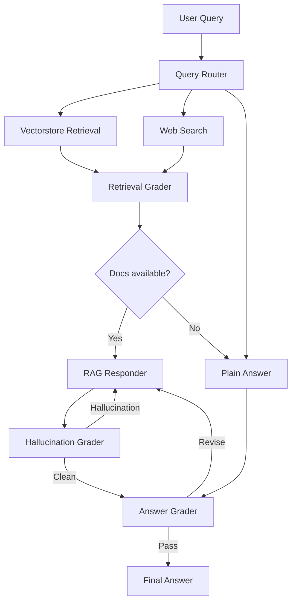

# Retrieval-Augmented Generation Pipeline

## 專案簡介
本專案以 Retrieval-Augmented Generation 架構為核心，整合內部文件的檢索、語意切分、重新排序 (Reranking) 以及事實驗證模組。  
結合 LangChain、OpenAI API 與重新排序模組的 RAG 系統，透過 LLM-as-a-Judge 與 Retrieval Grader 評估準確率，整體回覆正確率提升約 20%。

## 技術架構

| 模組 | 技術 |
|------|------|
| **開發框架** | LangChain、ChromaDB、OpenAI / HuggingFace Transformers |
| **核心流程** | Chunking → Embedding → Retrieval → Reranking → LLM Response |
| **模型支援** | OpenAI GPT-4、ChatGLM3-6B、Mistral-7B-Instruct |
| **資料庫** | 向量資料庫（ChromaDB） |
| **功能模組** | Query Router、Retrieval Grader、Pointwise & Pairwise Rerank、Hallucination & Answer Grader |
| **部署方式** | Streamlit / Gradio Web 介面 |

## 系統架構圖

